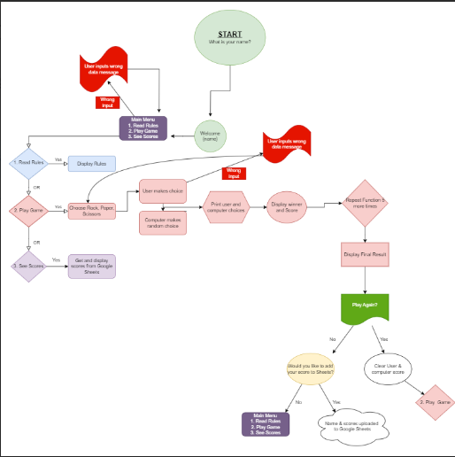

# Rock, Paper, Scissors
Welcome to Rock, Paper, Scissors - a well-known classic game of chance.  We've all played Rock,Paper,Scissors as a childhood game or even to make decisions akin to flipping a coin.

The earliest form of "rock paper scissors"-style game originated in China and was subsequently imported into Japan, where it reached its modern standardized form, before being spread throughout the world in the early 20th century. [Ref Wikipedia](https://en.wikipedia.org/wiki/Rock_paper_scissors) 

I wanted to take this simple classic, writing the majority in Python, and challenge myself to make this terminal based game fun and engaging.

The live site can be found [Here](https://rock-paper-scissors-cipp3-2dd227d48d85.herokuapp.com/)

## Contents:
- [UX (User Experience)](#uxuser-experience)    
- [Design](#design)
   - [Flow Chart](#flow)
   - [Features](#features)
- [Technology Used](#technologies-used)
- [Testing](#testing)
   - [Issues and Resolutions](#issues-and-resolutions)
   - [Validation](#validation)
- [Deployment](#deployment)
- [Credits](#credits)

## UX(User Experience)
[Back to Top](#rock-paper-scissors)  
### First time User Goals:
As a first time user, I would like to:
1. Have clear instructions on what I need to do
2. Choose an option, and that option display as expected
3. Learn or remind myself of the rules
4. Go straight to playing the game if I already know the rules
5. Be able to see a tally of my score
6. Be able to play again or exit the game if I am finished

### Developer Goals:
[Back to Top](#rock-paper-scissors)  
As a developer, I would like:
1. To make the game more personal, by asking the user's name
2. Make the options clear and consise for the user to choose from
3. Have the rules as an option, so players can go straight to gameplay should they already be familiar with the rules
4. Give the computer a bit of personality for better user experience ie.The computer will call the user by their name

### Return User Goals:
[Back to Top](#rock-paper-scissors)  
As a return user, I would like to:
1. Be able to see my previous score and add to them if I beat them.

## Design
[Back to Top](#rock-paper-scissors)  
Design ideas here
Banner using

### Flow Chart
[Back to Top](#rock-paper-scissors)  
I used a flow chart to visualise the functions I would need to use, and to try to predict any user/computer errors before they arise.  

### Features
[Back to Top](#rock-paper-scissors)  
Welcome screenshot
Add name
Rules Page
Game Scores after each

### Future Features
[Back to Top](#rock-paper-scissors)  
ideas here

## Technologies Used
[Back to Top](#rock-paper-scissors)  
1. Python
2. Github
3. Gitpod
4. Heroku
5.

## Testing
[Back to Top](#rock-paper-scissors)  
table here

### Issues and Resolutions
[Back to Top](#rock-paper-scissors)  
1. The first bug I came across was on the Banner I created. I kept getting an "invalid escape sequence" and my code would not run.  I found the answer on Stack Overview which suggested I use 2 trailing backslashes where the issue was and that seemed to fix it.
2. On the first go, the code was jumping straight into the game, without giving the menu option - with the help of my tutor, we figured that it was because my variables num_games, player_score and comp_score, could not be accessed until I made them Global, this fixed the issue.
3. Using int(input), I wrongly presumed the user would input an integer when asked. During testing, when I put in an alpha letter, my game crashed due to lack of input validation and error handling. To solve this, I used the isdigit() method and displayed a message to the user.

### Validation
[Back to Top](#rock-paper-scissors)  
pep8

## Deployment
[Back to Top](#rock-paper-scissors)  
I deployed the project through Heroku. The project was developed on Gitpod and committed and pushed to Github. Heroku automatically updates once deployed.

The Deployment Process is as follows:
1. Log in to Heroku and click "Create New App"
2. Choose a unique name and select your region
3. Click "Create App"
4. In "Settings" tab, navigate to "Config Var(a.k.a environment variables) and click "Reveal config vars".
5. Add Keys and Values here
6. CLick on "Add buildpacks"(further dependencies needed)
7. Click Python and nodejs. Ensure Python comes first in the list
8. Go to "Deploy" tab
9. Select Github as deployment method and search for your Github repository name
10. Click "Connect"
11. Click "Deploy Branch" to begin deployment. Watch the app being built.
12. Click "View" to see the app in the terminal

## Credits
[Back to Top](#rock-paper-scissors)  
1. Tutorial on how to make the banner [Naufal Ardhani](https://naufalardhani.medium.com/how-to-create-ascii-text-banner-for-command-line-project-85e75dc02b07)  
2. Text Art Generator for the banner [TAAG](https://patorjk.com/software/taag/#p=display&f=Graffiti&t=Type%20Something%20)  
3. I used **draw.io** to create the flow chart, helping me with the program logic
3. I read an article on **Skool of Code** for help with the while loop on counting scores
4. I read an article on **Stackabuse.com** for handling yes or no user input
5. **Code Institute** for providing the template to start and host the project, help with connecting sheets and displaying data from Sheets to the terminal (Love Sandwiches)
6. **W3schools** article on built-in python methods, time and random
7. Tutor support from Code Institute to help me figure out solutions
8. My mentor **Dick Vlaanderen** who is a fountain of knowledge and support

## Libraries Used
[Back to Top](#rock-paper-scissors)  
1. random
2. time
3. gspread
4. google auth