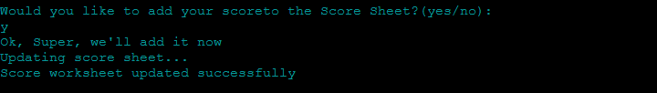
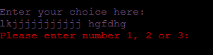

# Rock, Paper, Scissors
Welcome to Rock, Paper, Scissors - a well-known classic game of chance.  Most of us have played Rock, Paper, Scissors at some point in our lives either as a childhood game or even to make decisions, akin to flipping a coin.

The earliest form of "rock paper scissors"-style game originated in China. It was subsequently imported into Japan, where it reached its modern standardized form, before being spread throughout the world in the early 20th century. [Ref Wikipedia](https://en.wikipedia.org/wiki/Rock_paper_scissors) 

I wanted to take this simple classic game, write the majority of it in Python, and challenge myself to make this terminal-based game fun and engaging.

The live site can be found [Here](https://rock-paper-scissors-cipp3-2dd227d48d85.herokuapp.com/)


## Contents:
- [UX (User Experience)](#uxuser-experience)    
- [Design](#design)
   - [Logic Diagram](#logic-diagram)
   - [Features](#features)
- [Playing the Game](#playing-the-game)
   - [Invalid Inputs](#invalid-input-responses)
- [Technology Used](#technologies-used)
- [Libraries Used](#libraries-used)
- [Testing](#testing)
   - [Issues and Resolutions](#issues-and-resolutions)
   - [Validation](#validation)
- [Deployment](#deployment)
   - [Cloning](#cloning-the-repository)
   - [Forking](#fork-the-repository)
- [Credits](#credits)

## UX(User Experience)
[Back to Top](#rock-paper-scissors)  
### First time User Goals:
As a first time user, I would like to:
1. Have clear instructions on what I need to do
2. Choose an option, and that option display as expected
3. Learn or remind myself of the rules
4. Go straight to playing the game if I already know the rules
5. Be able to see a tally of my score
6. Be able to play again or exit the game if I am finished

### Developer Goals:
[Back to Top](#rock-paper-scissors)  
As a developer, I would like:
1. To make the game more personal, by asking the user's name
2. Make the options clear and concise for the user to choose from
3. Have the rules as an option, so players can go straight to gameplay should they already be familiar with the rules
4. Give the computer a bit of personality for a better user experience ie. The computer will call the user by their name throughout the game.

### Return User Goals:
[Back to Top](#rock-paper-scissors)  
As a return user, I would like to:
1. Be able to see my previous score and add to them if I beat them.

## Design
[Back to Top](#rock-paper-scissors)  
For the design of the terminal, I decided to keep it quite simple. I used a pink background, as magenta was my main font colour.  The font colours used were red, for invalid input messages, white, cyan and yellow to give the output some more interest and fun.

I created a banner using an ASCII Text to Art Generator, which gives some visual game effects for the user in the terminal.


I added a simple heading on the page with a border in a complimentary grey colour.
I also centered the terminal and header, as I thought it looked more aethetically pleasing.

I imported the time library to create a slow down effect on the programme using the sleep method, as I felt it was too "instant", and not giving a great user experience.  This slowed down the process a little so that the user had time to read the screen before terminal clearings.

### Logic Diagram
[Back to Top](#rock-paper-scissors)  

I used a logic diagram to visualise the functions I would need to use, and to try to predict any user/computer errors before they arise.  
[Logic Diagram](assets/images/flow-chart.png)


### Features
[Back to Top](#rock-paper-scissors)  
To make the game a little more personable, the computer will ask for the user's name, which if the user so chooses, will also be used to enter into the Google Score Sheet. Should the user input all lowercase letters, the programme will capitalize the first letter by using the title() method.


I included an if statement to ensure the user doesn't leave the Name blank, they can use numbers and letters if they so choose.


The Menu list of options will appear after the Welcome message:


If the user decides to view the Rules Page by selecting option "1", they will be given the different winning combinations:


If the user chooses option "2", the game will start:


If "3" is selected from the menu, the programme will fetch the
score sheet from Google Sheets:


## Playing the Game
The game consists of 5 rounds. After each round, the choices made by the user and the random choice made by the computer will display.  Then a message to say who won will display and finally the tallied score. The terminal will then clear, and the next round will commence.


The number of rounds will display at the top of each game, to let the user know where they are in the game play.


After all 5 rounds have been played, the final score will be displayed with a message of congratulations or commiserations depending on whether the user won or lost the full game:


The user will then be asked if they would like to play again.  If they choose yes, the game will begin again and the scores will be cleared.

If the user decides not to play again, the programme will ask if they would like to add their scores to the score sheet.


If they choose yes, the following message will be displayed:



The programme will then return to the main menu.

### Invalid Input Responses:
Should the user input something other than the choices of 1,2 or 3 in the menu, an error message will appear with a reminder of what numbers should be used:



If the user inputs something other than the required integers during the game, the same message will repeat until a correct number has been entered.


At the end of the game, the question to play again requires a "yes"/"y", or "no"/"n" input, which will also display as an error and what is required instead:


*The same message will appear when the user is asked if they would like to enter their score into Google Sheets and they enter an invalid response.


### Future Features
[Back to Top](#rock-paper-scissors)  
1. In the future, I would like to offer a Top scorer's list.
2. I would also like to feature harder levels, as you progress through the game, more items would be added to make the chances of winning lower.
3. I would like to implement an option to play with a friend instead of the computer.


## Technologies Used
[Back to Top](#rock-paper-scissors)  
1. Python - Language used to write the programme
2. Github - Version control
3. Gitpod - IDE used to code the programme
4. Heroku - Used to deploy for users to access
5. HTML - Used to display the background
6. CSS - Used to colour and pad the background

## Libraries Used
[Back to Top](#rock-paper-scissors)  
1. random - Used to get computer to make a random selection
2. time - Used to access sleep method for pauses during game
3. gspread - Used for CRUD actions on Google Sheets
4. credentials - Imported from googleauth to allow access to Google Sheets
5. Google Sheets - Cloud based service used to store player names and scores


## Testing
[Back to Top](#rock-paper-scissors)  

### Testing Table
| Feature:               | Expected outcome:                                                 | Pass/Fail: |
| :--------------------- | :---------------------------------------------------------------- | :--------- |
| Heroku Url link        | Page is displayed and program runs                                | Pass       |
| Enter User Name        | Programme asks for user name                                      | Pass       |
| Capitalize Name        | If user inputs lower case name, capitalize it                     | Pass       |
| Welcome Message        | Display welcome message using players name                        | Pass       |
| Main menu              | Display Main menu options and ask player to choose                | Pass       |
| Error Message          | Display error message if wrong input on menu choice               | Pass       |
| View Game Rules        | If choice 1 is picked, display the rules & clear terminal         | Pass       |
| See Score Sheet        | If choice 3 is picked, Fetch Google Score sheet and display names & scores               | Pass       |
| Start Game             | If choice 2 is picked, clear terminal and begin game Round 1      | Pass       |
| Error Message          | Display error message if wrong input on game choice               | Pass       |
| Run Game               | Player chooses, computer picks randomly                           | Pass       |
| Display Choices        | Display Players choice and computer's choice                      | Pass       |
| Compare choices        | Tell the player if they have won or lost this round               | Pass       |
| Display score          | Display tallied scores Player VS. Computer                        | Pass       |
| Clear Terminal         | Clear the terminal between each round                             | Pass       |
| Play Rounds            | Play a total of 5 rounds per game                                 | Pass       |
| Final Round            | Display final score with message                                  | Pass       |
| Play again             | Display play again question                                       | Pass       |
| Error Message          | Display error message if "yes" or "no" / "y" or "n" is not entered| Pass       |
| Play again - Yes       | If player wants to play again - start game and clear scores       | Pass       |
| Play again - No        | If player doesn't want to play again, display message & question  | Pass       |
| Score Sheet            | Ask if player would like to add score to sheet                    | Pass       |
| Score Sheet - Yes      | Upload player's name & score to Google Sheet                      | Pass       |
| Score Sheet - No       | If player doesn't want to add score - go to main menu             | Pass       |
| Instant Updated Sheet          | After player updated sheet, check score sheet is updated without re-running the programme again   | Pass    |


### Issues and Resolutions
[Back to Top](#rock-paper-scissors)  

1. The first bug I came across was on the Banner - "Rock Paper Scissors". I kept getting an "invalid escape sequence" error and my code would not run.  I found the answer on Stack Overview which suggested I use 2 trailing backslashes where the issue was.  
  Unfortunately, this only fixed the programme running but the syntax error was still occurring. After more searching online, I learned that using a raw string instead worked and the programme ignored what was contained in it.

2. On the first programme run, the code was jumping straight into the game, without giving the menu option - with the help of my tutor, we figured that it was because my variables num_games, player_score and comp_score, could not be accessed until I made them Global, this fixed the issue.

3. Using int(input), I wrongly presumed the user would input an integer when asked. During testing, when I put in an alpha letter, my game crashed due to lack of input validation and error handling. To solve this, I used the isdigit() method and displayed a message to the user.


### Validation
[Back to Top](#rock-paper-scissors)  

I passed my code through Code Institutes Python Linter, it came back clear with no errors.


## Deployment
[Back to Top](#rock-paper-scissors)  

I deployed the project through Heroku. The project was developed on Gitpod and committed and pushed to Github. Heroku automatically updates once deployed.

The Deployment Process is as follows:
1. Log in to Heroku and click "Create New App"
2. Choose a unique name and select your region
3. Click "Create App"
4. In "Settings" tab, navigate to "Config Var (a.k.a environment variables) and click "Reveal config vars".
5. Add Keys and Values here
6. Click on "Add buildpacks" (further dependencies needed)
7. Click Python and nodejs. Ensure Python comes first in the list
8. Go to "Deploy" tab
9. Select Github as deployment method and search for your Github repository name
10. Click "Connect"
11. Click "Deploy Branch" to begin deployment. Watch the app being built.
12. Click "View" to see the app in the terminal

### Cloning the Repository

To clone the repository:
1. Go to the [Github repository](https://github.com/RdeSwart/rock-paper-scissors)
2. Click on the "<>Code" button located above the list of files
3. Choose whether you prefer to clone using HTTPS, SSH or Github CI.
4. Copy the URL to clipboard

   ```git@github.com:RdeSwart/rock-paper-scissors.git```
5. Open Git Bash or Terminal
6. Change the current working directory to where you would
like the cloned directory.
7. In the IDE terminal, paste the link
8. Press Enter to create the local clone

### Fork the Repository

To fork the repository:
1. Open the [Github repository](https://github.com/RdeSwart/rock-paper-scissors)
2. Click on the "Fork" button at the top of the screen
3. On "Create New Fork" page, rename the repository
4. Click "Create Fork" at the bottom of the form


## Credits
[Back to Top](#rock-paper-scissors)  

1. Tutorial on how to make the banner [Naufal Ardhani](https://naufalardhani.medium.com/how-to-create-ascii-text-banner-for-command-line-project-85e75dc02b07)  
2. Text Art Generator for the banner [TAAG](https://patorjk.com/software/taag/#p=display&f=Graffiti&t=Type%20Something%20)  
3. I used **draw.io** to create the flow chart, helping me with the program logic
3. I read an article on **Skool of Code** for help with the while loop on counting scores
4. I read an article on **Stackabuse.com** for handling yes or no user input
5. **Code Institute** for providing the template to start and host the project, help with connecting sheets and displaying data from Sheets to the terminal (Love Sandwiches)
6. **W3schools** article on built-in python methods, time and random
7. Tutor support from Code Institute to help me figure out solutions
8. My mentor **Dick Vlaanderen** who is a fountain of knowledge and support

The live site can be found [Here](https://rock-paper-scissors-cipp3-2dd227d48d85.herokuapp.com/)
